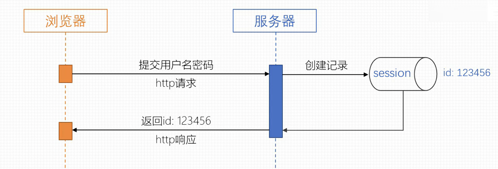

## 用户模块接口文档

---



### 前端将 token 提交到后端

将 token 塞到请求header里 ，格式为：`{tokenName: tokenValue}`
(tokenName可以在application.properties里面修改，默认为token)。

对于需要登陆的的接口 如果未登录则会有全局拦截器返回401。

---

## 验证码接口 (参考 AJ-Captcha)
验证码服务接口，用于获取、校验和二次验证验证码功能。

基础路径`/api/captcha`

###  获取验证码：
获取验证码信息，用于前端展示验证码图片


- **请求方法**: `POST`
- **请求路径**: `/api/captcha/get`

### 检查验证码：
校验用户输入的验证码是否正确

- **请求方法**: `POST`
- **请求路径**: `/api/captcha/check`


### 二次验证：
进行验证码的二次验证，用于重要操作前的身份确认

- **请求方法**: `POST`
- **请求路径**: `/api/captcha/verify`


#### 参数说明

CaptchaVO 包含验证码相关的验证信息，具体字段参考实现类。
返回统一的响应模型，包含验证结果和相关信息。

---


##  获取用户信息
获取用户个人资料信息,要求已经登陆状态才能访问。获取的信息比较详细不适用于公开访问。


- 路径`/api/auth/profile`
- 请求方式 `POST`

#### 未授权访问
```json
{
    "code": 401,
    "msg": "未授权，请先登录",
    "data": null
}
```
#### 访问成功

```json
{
  "code": 200,
  "msg": "ok",
  "data": {
    "id": 1,
    "username": "example_user",
    "nickname": "Example Nickname",
    "email": "user@example.com",
    "createTime": "2023-01-01T00:00:00",
    "updateTime": "2023-01-01T00:00:00",
    "avatarUrl": "https://example.com/avatar.jpg or null"
  }
}
```

---


##  获取 RSA 公钥
获取用 RSA 公钥,主要用来加密密码等敏感信息,同时提供临时token。

- 路径`/api/auth/public-key`
- 请求方式 `GET`

#### 访问成功

```json
{
    "code": 200,
    "msg": "ok",
    "data": {
        "tempToken": "TcoMKl.........SJ797Kli3S1Y",
        "publicKey": "MIIBI...........42ztOcMawIDAQAB"
    }
}
```

---

##  账号登陆
用于登陆账号。

- 路径`/api/auth/login`
- 请求方式 `POST`

#### 前端请求 Body

`captchaVerification`为验证码服务验证成功后返回的验证信息。
`password`使用 public-key 接口返回的公钥进行加密后的密码。

```json
{
  "username": "admin",
  "captchaVerification":"6mRZaI......ZZzAbUL8WHw=", 
  "tempToken":"2Em......htZnPmEc79",
  "password": "IaOD3....kqjVi4lvuXry8XaUAq9FtwmE21/0g=="
}
```

#### 访问成功
```json
{
  "code": 200,
  "msg": "ok",
  "data": {
    "token": "J062mk2fxe......82w34W3E9UbagD"
  }
}
```

#### 访问失败

`msg`中的内容根据错误类型返回。

```json
{
    "code": 400,
    "msg": "验证码已失效，请重新获取",
    "data": null
}
```