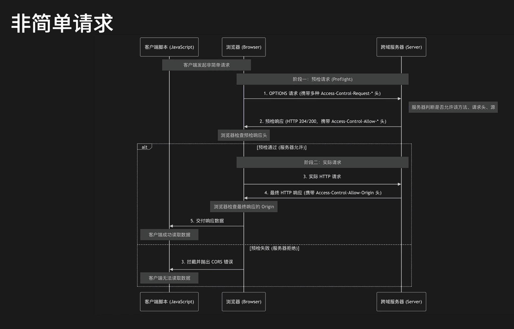

<h1 align="center" style="margin: 30px 0 30px; font-weight: bold;">MyBlog 后端应用</h1>
<h4 align="center">使用 SpringBoot 框架，方法实现采用更安全的方式。</h4>
<div align="center">

[](https://skillicons.dev)
</div>

---


> ### API对接 与数据库结构等文档
> - [用户认证API文档 `Auth_Api`](Document/Auth_Api.md)
> - [角色与权限组API文档 `Role_And_PermissionGroup_Api`](Document/Role_And_PermissionGroup_Api.md)
> - [数据库结构 `Myblog_Sql`](Document/Myblog_Sql.md)
> - [SEO配置接口文档 `Seo_Api`](Document/Seo_Api.md)
> - [账号管理（用户管理）接口文档 `User_Manage_Api`](Document/User_Manage_Api.md)
> - [站点配置接口文档 `Config_Api`](Document/Config_Api.md)
> - [限流逻辑说明文档 `RateLimit`](Document/RateLimit.md)
> - [权限层级与父子关系说明 `Permission_Hierarchy`](Document/Permission_Hierarchy.md)
> - [分类API文档 `Category_Api`](Document/Category_Api.md)
> - [网站友链API文档 `FriendLink_Api`](Document/FriendLink_Api.md)
> - [文章管理文档 `Blog_Api`](Document/Blog_Api.md)
> - [公共文章API文档 `PublicArticle_Api`](Document/PublicArticle_Api.md)
> - [评论与全局评论API文档 `Comment_Api`](Document/Comment_Api.md)
> - [公共评论API文档 `PublicComment_Api`](Document/PublicComment_Api.md)
> - [全局文章API文档 `GlobalArticle_Api`](Document/GlobalArticle_Api.md)
> - [公共分类API文档 `PublicCategory_Api`](Document/PublicCategory_Api.md)
> - [OSS对象存储API文档 `OSS_Api`](Document/OSS_Api.md)
> - [全局OSS管理API文档 `GlobalOss_Api`](Document/GlobalOss_Api.md)
> - [邮箱接口文档 `Mail_Api`](Document/Mail_Api.md)

---

```
# 查看当前配置
java -jar myblog_dev.jar --help

# 启动时覆盖配置
java -jar myblog_dev.jar --app.cors.allowed-origins="https://prod.example.com"

```

---

## 项目开发参考

### 关系参考图




---

## 项目结构
```
src/main/java/com/jiuliu/myblog_dev/
├── config/                 # 配置类
│   ├── CorsConfig
│   ├── GlobalExceptionHandler
│   ├── RsaKeyConfig
│   ├── Captcha/
│   ├── rsa/
│   ├── satoken/
│   ├── security/
│   └── validation/
├── controller/user/        # 控制器（按业务域划分）
│   ├── auth/
│   └── permission/
├── dto/                    # 数据传输对象
├── entity/                 # 实体类
├── mapper/                 # MyBatis Mapper
├── service/user/           # 服务层（接口 + 实现分离）
│   ├── auth/
│   └── permission/
└── utils/                  # 工具类
```


### 鉴权 API 说明

您可以这样使用鉴权：

``` java

// 获取权限列表
List<String> permissionList = StpUtil.getPermissionList();

// 判断权限
boolean hasPermission = StpUtil.hasPermission("system:user:list");

// 检查权限（未通过则抛出异常）
StpUtil.checkPermission("system:user:list");

// 检查多个权限（全部通过）
StpUtil.checkPermissionAnd("system:user:list","system:user:create");

// 检查多个权限（任一通过）
StpUtil.checkPermissionOr("system:user:list","system:user:delete");

// 获取角色列表
List<String> roleList = StpUtil.getRoleList();

// 判断角色
boolean hasRole = StpUtil.hasRole("ADMIN");

// 检查角色（未通过则抛出异常）
StpUtil.checkRole("ADMIN");

// 检查多个角色（全部通过）
StpUtil.checkRoleAnd("ADMIN","SUPER_ADMIN");

// 检查多个角色（任一通过）
StpUtil.checkRoleOr("ADMIN","SUPER_ADMIN");
```

控制器中使用权限验证：

``` java
@RestController
@RequestMapping("/api/admin")
public class AdminController {

    // 参考数据库的 sys_permission 表中的 system:user:list 权限
    @SaCheckPermission("system:user:list")
    @GetMapping("/users")
    public SaResult getUserList() {
        // 业务逻辑
        return SaResult.ok("用户列表");
    }

    @SaCheckRole("ADMIN")
    @PostMapping("/users")
    public SaResult createUser() {
        // 业务逻辑
        return SaResult.ok("用户创建成功");
    }
}
```

### 行为验证码（Tianai-Captcha，基于 /api/captcha 前缀）：

当前项目使用 **Tianai-Captcha** 作为行为验证码组件，接口说明如下：

| 接口                    | 方法  | 说明                                       |
|-----------------------|-----|------------------------------------------|
| `/api/captcha/gen`    | GET | 生成验证码（默认滑块，可通过 `type` 指定类型）      |
| `/api/captcha/check`  | POST| 校验用户行为轨迹（滑动 / 旋转 / 文字点选等）           |
| `/api/captcha/verify` | GET | 二次验证（需在配置中开启 `captcha.secondary.enabled`） |

验证码背景图片从 `resources/images` 目录加载（例如 `a.png`、`b.png`、`c.png`、`48.png`），跨域策略统一复用项目的 `CorsConfig` 配置。 

